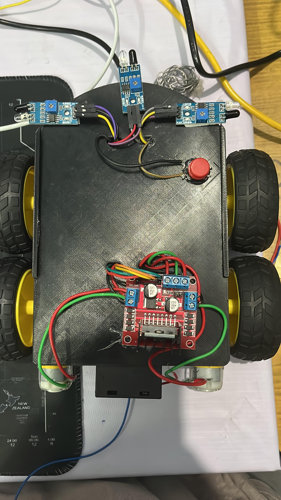
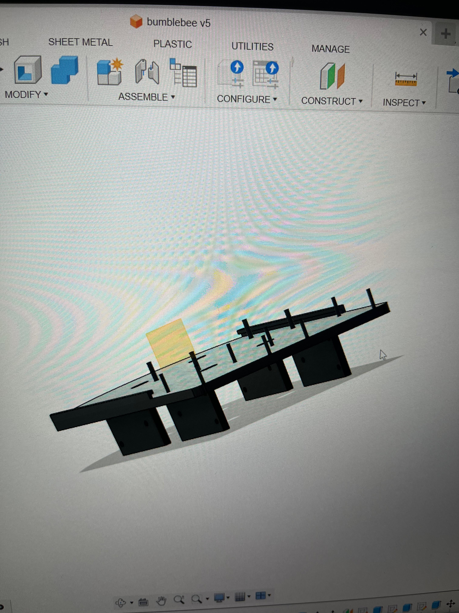
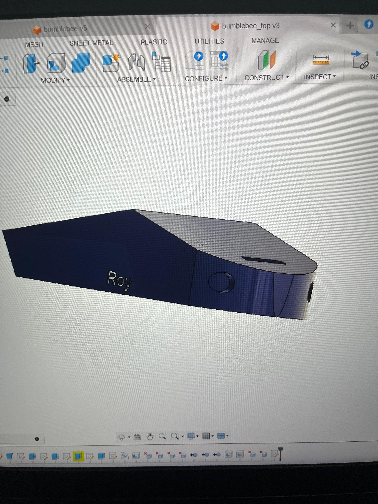

# Raspberry Pi 4 ROS Robot

Hey there!  
This is my personal robotics project built using a modified version of the template from Articulated Robotics. I started by running simulations, and then moved on to building the actual robot. It's powered by ROS, a Raspberry Pi 4, an Arduino, and some basic IR sensors.

Right now, it can handle basic tasks and respond to sensor input. I'm planning to add full SLAM navigation (probably using SOAM soon), and there’s a lot more coming as I keep tinkering with it. Things might change pretty often while I test and improve the design, so feel free to explore or adapt it however you want.

## What it does so far
- Basic obstacle detection with IR sensors  
- ROS integration between Raspberry Pi and Arduino  
- Simulation-first development using Gazebo and RViz  
- Manual control and sensor feedback  

## What’s coming next
- SLAM (SOAM) navigation  
- Dynamic map updates  
- Autonomous decision-making  
- Potential vision support or depth sensors  
- General cleanup and optimization  

## Hardware setup
- Raspberry Pi 4 (4GB)  
- Arduino Uno  
- IR sensors (3x)  
- Power supply  
- Custom chassis and motor driver setup  

## Software
- ROS Noetic running on Ubuntu 20.04 (on Pi)  
- Arduino code for motor and sensor interface  
- Gazebo + RViz for simulation  
- Custom ROS nodes for movement and sensing  

## Images and Videos

### Images

  
  

### Videos  

[Watch Initial Stage 2.1](./images/test2.1.mp4)  
[Watch Initial Stage 2.2](./images/test2.3.mp4)

## How to run (will update more as I go and finish it!)

For now, plug in the hardware, start the ROS core, and launch your nodes.  
If you're running the sim, just use your favorite launch files and tweak them as needed.

---

Feel free to fork, modify, or suggest improvements.  
This project is all about learning, building, and having fun with robotics.
